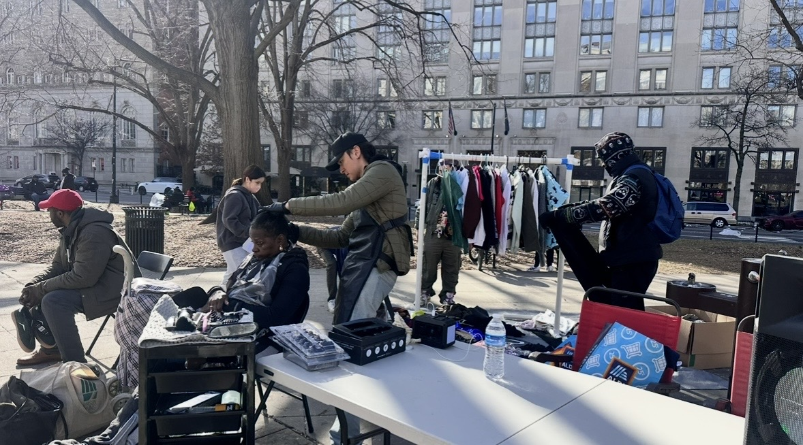
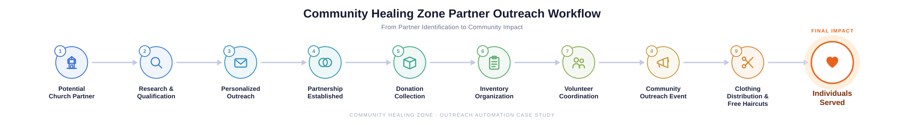
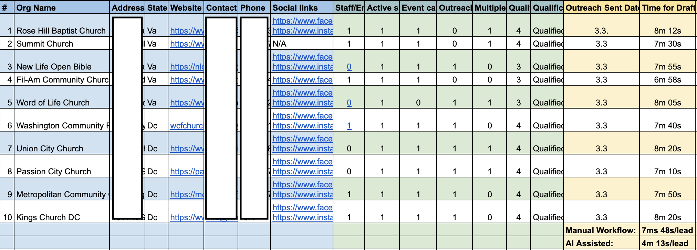
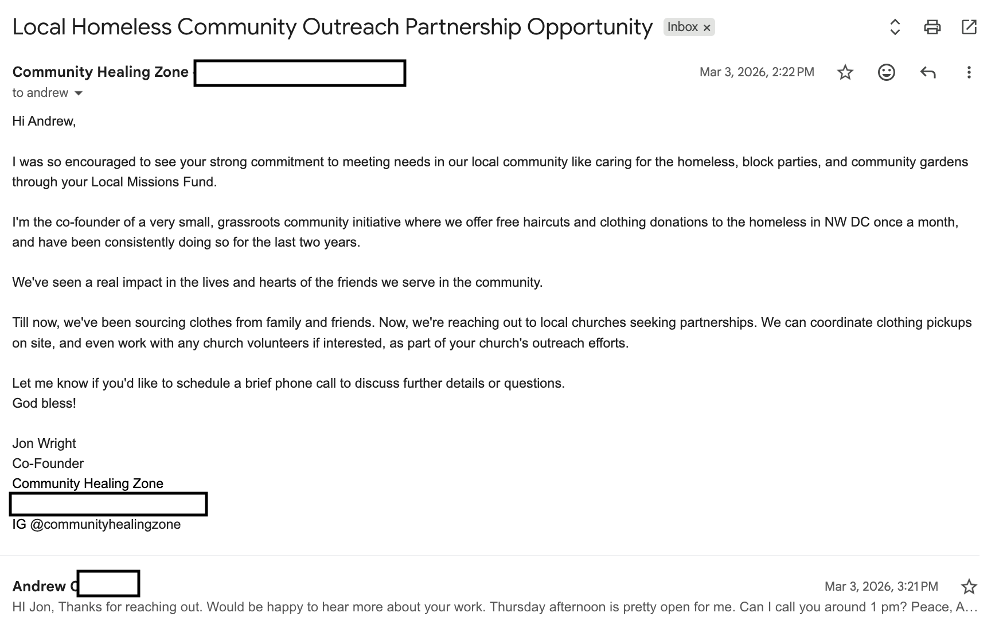

# Nonprofit Lead Sourcing & Outreach Automation

Helping Community Healing Zone identify, qualify, and connect with local churches and organizations for clothing donation partnerships.

Built to reduce research time, improve outreach quality, and support monthly homeless outreach events in Washington DC.

---

## Results at a Glance

- 45.94% reduction in processing time
- 84.98% increase in lead sourcing throughput
- 7.69 → 14.23 leads per hour
- +32.69 additional leads per 5-hour work session
- Supported real-world partnership development for Community Healing Zone

---

## Background

Two years ago, I founded a community outreach initiative called Community Healing Zone. Through monthly events, our volunteers distributed clothing, hygiene supplies, and free haircuts to individuals experiencing homelessness in the Washington, DC area.

Early growth came primarily through friends, family, and personal networks. Over time, donations began arriving faster than we could distribute them, and we eventually ran out of storage space. It became clear that relying solely on personal connections would limit the organization's ability to grow.

Churches felt like a natural next source of partnerships and support, but researching organizations, identifying contacts, drafting outreach, and tracking communication manually was extremely time-consuming.

This project explored whether AI-assisted workflows could increase outreach capacity while still preserving personalization and human judgment.

## Problem

The initial outreach process relied on manually:

- Researching potential partner organizations
- Identifying outreach contacts
- Reviewing websites and mission alignment
- Drafting personalized outreach messages
- Tracking outreach activity

As outreach volume increased, the process became difficult to scale efficiently. 

## Approach

To establish a baseline, I timed the full outreach process across multiple organizations, including research, qualification, contact discovery, outreach drafting, and logging.

## Redesigned Workflow

The redesigned workflow standardized research, qualification, outreach generation, and tracking while maintaining personalized communication with prospective partners.

The redesign featured an AI-assisted workflow that supports: 

1. Organization Discovery
2. Qualification & Research
3. Contact Identification
4. Personalized Outreach Creation
5. Follow-Up & Partnership Development
   

## Research & Qualification Dashboard

A structured dashboard was used to track organizations, qualification criteria, outreach status, contact information, and partnership opportunities.

Sensitive contact information has been removed for privacy.
Human review remained part of the process before any communication was sent.

## Personalized Outreach Example

Rather than sending generic mass emails, each organization received outreach tailored to its mission, programs, and community involvement.

The workflow emphasized personalization over volume.

## Results

Testing Sample

- 10 organizations evaluated
- Manual baseline established
- AI-assisted comparison conducted

### Manual Process

- Average time per lead: 7m 48s
- Throughput: 7.69 leads/hour

### AI-Assisted Process

- Average time per lead: 4m 13s
- Throughput: 14.23 leads/hour

## Lessons Learned

I initially expected outreach drafting to be the largest bottleneck. After reducing drafting time, the next constraint became locating decision-makers and finding reliable contact information. Improving one stage of the workflow exposed the next bottleneck. The project also reinforced that successful automation is often less about replacing people with new technology and more about helping people focus on higher-value work. 

## Next Iteration

Future versions may include:

- Automated contact discovery
- Lead scoring
- Outreach prioritization
- Dashboard automation
- Performance monitoring

## Repository Contents

### Docs

- case-study-writeup.pdf
- executive-summary.pdf
- presentation-deck.pptx
- outreach-tracking-dashboard.xlsx

### Images

── community-outreach-event.jpg
── efficiency-impact.png
── nonprofit-workflow-diagram.png
── outreach-dashboard.png
── outreach-email-example.png
── throughput-comparison.png
── time-reduction-per-lead.png
